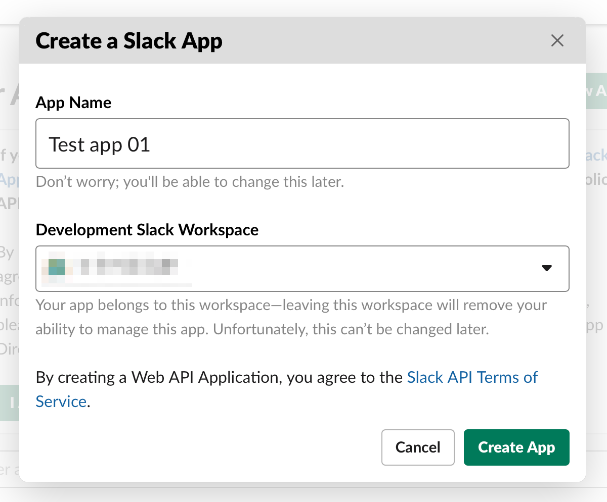

# slack-file-download

A script that download files uploaded to Slack.

## Requirements

- Ruby 2.7+

## Installation

### e.g.

```
$ bundle install --path vendor/bundle
```

## Usage

### Create a Slack app and setting it

#### 1. Create a Slack app



#### 2. Add scope

1. Basic Information
2. Permissions
3. Scopes
4. Add an OAuth Scope
5. Add `files:read`


#### 3. Install App to Workspace


#### 4. Allow it


#### 5. Get an OAuth Access Token


### Setup `.env`

Create `.env` and set `ACCESS_TOKEN`.

```
ACCESS_TOKEN=xxxxx
```

### Execute a command

```
$ bundle exec ruby download.rb
```

## Environment variables

```
ACCESS_TOKEN          - OAuth Access Token of Slack
DOWNLOAD_DIR          - Donwload directory (default: download)
WAIT_SECONDS_ON_ERROR - Wait seconds on error (default: 10)
```

## Author

[dounokouno](https://github.com/dounokouno)

## License

MIT License

## References

- [Slack API](https://api.slack.com)
- [slack-ruby/slack-ruby-client](https://github.com/slack-ruby/slack-ruby-client)
